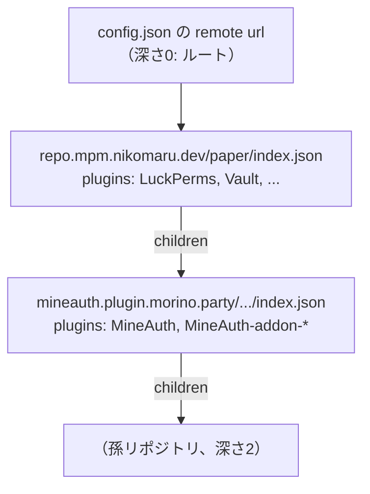

import { Callout } from "fumadocs-ui/components/callout";

リモートリポジトリは、静的ファイル1つ（`index.json`）で表現されます。
インデックスにはそのリポジトリが定義する全プラグインと、**子リポジトリへのリンク**が含まれます。
mpmはルートのインデックスからリンクを再帰的にたどり、複数のリポジトリを1つのカタログに合成します。

<Callout type="info" title="サーバー側のロジックは不要">
インデックスはただのJSONファイルです。GitHub PagesやCloudflare Workers Assetsなどの静的ホスティングに
`index.json` を置くだけでリポジトリとして機能し、他のリポジトリから子としてリンクされることもできます。
リンク先の解決はすべてmpm（クライアント）側で行われます。
</Callout>

## 📄 index.json の構造

```json title="index.json"
{
    "$schema": "https://repo.mpm.nikomaru.dev/schema/repository-index/v1.json",
    "schemaVersion": 1,
    "name": "morinoparty",
    "generated": "2026-09-22T00:00:00.000Z",
    "plugins": {
        "LuckPerms": {
            "id": "LuckPerms",
            "website": "https://luckperms.net/",
            "repositories": [{ "type": "modrinth", "id": "luckperms" }]
        }
    },
    "children": [
        {
            "index": "https://mineauth.plugin.morino.party/mpm/paper/index.json"
        }
    ]
}
```

### フィールド

- **schemaVersion**: インデックス形式の版数。現在は `1`
- **name**: リポジトリの表示名（任意、ログ用）
- **generated**: 生成時刻（任意、デバッグ用）
- **plugins**: プラグイン名 → [リポジトリファイル](/docs/repository/file)のマップ。
  キーと `id` は一致していなければなりません
- **children**: 子リポジトリへのリンクの配列（任意）

### 🔗 children（子リポジトリへのリンク）

リンクは基本的に **URLだけ** で成り立ちます。子はどんな名前のプラグインでも定義でき、
リポジトリ同士をチェーンのようにつないでカタログを広げられます。
同名のプラグインは祖先側が勝つため、子が親の定義を上書きすることはできません。

- **index**: 子の `index.json` の絶対URL。`https://` 限定で、IPアドレス・`localhost`・`.local` ドメインは拒否されます
- **allowedSources**（任意）: 子が `repositories[]` に書いてよい配布元を絞りたい場合に指定します。
  `type:id` 形式で、末尾 `*` のみワイルドカード。大文字小文字は区別しません
  （例: `"github:morinoparty/MineAuth"`, `"modrinth:9LoU3yUC"`, `"github:morinoparty/*"`）。
  省略すると配布元は制限されません

```json title="配布元を絞る例"
{
    "index": "https://mineauth.plugin.morino.party/mpm/paper/index.json",
    "allowedSources": ["github:morinoparty/*", "modrinth:9LoU3yUC"]
}
```

<Callout type="info" title="allowedSources は子から先にも効く">
`allowedSources` を指定したリンクの先で、子がさらに孫へリンクを張った場合、孫の定義にも
**経路上のすべてのリンク**の `allowedSources` が重ねて適用されます。子は親から与えられた範囲を広げられません。
</Callout>

## 🔍 解決の仕組み

mpmは `config.json` の[リモートソース](/docs/format/config#リモートソース)ごとに次の手順でカタログを組み立てます。

1. `url` のインデックス（ルート、深さ0）を取得する
2. `children` を幅優先でたどり、**深さ5まで**のインデックスを取得する
3. 各インデックスの `plugins` をカタログに取り込む

このとき、以下の規則が適用されます。

| 規則 | 内容 |
| --- | --- |
| 親が勝つ | 同名のプラグインが複数のインデックスにある場合、先に見つかった（浅い）側の定義が採用されます。ルートの定義は常に子より優先されます |
| 名前の制限なし | 子が定義できるプラグイン名に制限はありません。配布元は Modrinth / GitHub / SpigotMC / Hangar のいずれかで、リンクに `allowedSources` があればそれにも収まる必要があります |
| 深さの上限 | ルートを深さ0として深さ5のノードまで読み取ります。それより先の `children` は無視され、警告がログに出ます |
| 循環参照 | 同じURLは一度しか取得しません。相互にリンクしていても無限ループにはなりません |
| ノード数の上限 | 1回の探索で取得するインデックスは最大50件です |
| サイズ上限 | 1つのインデックスは1MBまでです |
| リダイレクト | HTTPリダイレクトは追いません（リンク先の安全性検証を迂回されないため）。ルートの `url` も最終的なURLを指定してください |
| 子のタイムアウト | 子リポジトリの取得は1件あたり10秒でタイムアウトし、そのリポジトリの分だけが欠けます |
| 危険なフィールドの除去 | 子由来の定義からは `downloadUrl` と `fileNameTemplate` が落とされます。これらは管理者が直接指定したルートのリポジトリだけで有効です |
| 部分的な失敗 | 子リポジトリの取得や解析に失敗しても、そのリポジトリの分だけが欠け、他は通常どおり利用できます。ルートの取得に失敗した場合はそのソース全体が利用不可になります |
| ヘッダーの扱い | `headers` で指定した認証ヘッダー等はルートにだけ送られ、子リポジトリには転送されません |



## 🏗️ 公式リポジトリの構成

`repo.mpm.nikomaru.dev` の `index.json` は、リポジトリ（`repo/`）の次のファイルから
`pnpm run build`（`repo/scripts/build.ts`）で生成されます。

- `public/paper/plugins/<id>.json`: プラグイン定義（1プラグイン1ファイル、レビュー用の正本）
- `public/paper/children.json`: 子リポジトリへのリンク一覧

```json title="repo/public/paper/children.json"
[
    {
        "index": "https://mineauth.plugin.morino.party/mpm/paper/index.json"
    }
]
```

ビルドでは各プラグイン定義と `children.json` をスキーマ検証したうえで `index.json` と
JSON Schema（`/schema/plugin-info/v1.json`, `/schema/repository-index/v1.json`）を静的ファイルとして書き出します。
検証に失敗するとデプロイは止まり、壊れたカタログは配信されません。

## 🧩 自分のプラグインを子リポジトリとして配信する

プラグイン提供者は、自身のサイトに `index.json` を置くだけでmpmのカタログに参加できます。

1. 上記の形式で `index.json` を作成し、`plugins` に自身のプラグイン定義を書く
2. 静的ホスティングで `https://` 配信する（`$schema` を書いておくとIDEで補完・検証が効きます）
3. 親リポジトリ（例: 公式リポジトリの `children.json`）に `index` を追加してもらう

子のインデックスは、自身の配下にさらに `children` を持つこともできます（深さ5まで）。

## 関連ドキュメント

- [リポジトリの概要](/docs/repository) - リポジトリ全体の構成
- [リポジトリファイル](/docs/repository/file) - `plugins` に書く各プラグイン定義の仕様
- [プラグイン設定 (config.json)](/docs/format/config) - リモートソースの設定方法
