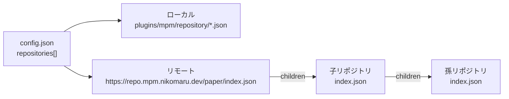

import { Callout } from "fumadocs-ui/components/callout";

mpmにおける**リポジトリ**とは、「どのプラグインを、どこから（Modrinth / GitHub / SpigotMC / Hangar）
ダウンロードするか」を定義したカタログです。`mpm add <プラグイン名>` は、このカタログから
プラグインの定義を探して `mpm.json` に登録します。

## 🧱 構成要素

| 要素 | 役割 | ドキュメント |
| --- | --- | --- |
| リポジトリファイル | プラグイン1件分の定義（`id`、`repositories`、依存関係など） | [リポジトリファイル](/docs/repository/file) |
| リポジトリインデックス | リモートリポジトリが配信する `index.json`。全プラグイン定義と、子リポジトリへのリンクを含む | [リポジトリインデックス](/docs/repository/graph) |
| リポジトリソース | `config.json` で指定する、mpmがカタログを読む場所（ローカルディレクトリ / リモートURL） | [プラグイン設定 (config.json)](/docs/format/config#リポジトリソース) |

## 🗺️ 全体像

- **ローカルソース**は `plugins/mpm/repository/` にリポジトリファイルを1つずつ置くだけの最もシンプルな形です
- **リモートソース**は静的ファイル `index.json` を読みます。インデックスは他のインデックスへリンク（`children`）でき、
  mpmはそれをチェーンのようにたどって1つのカタログに合成します（最大深さ5）
- 複数のソースは `config.json` の並び順で優先され、同名のプラグインは先に見つかった定義が採用されます

<Callout type="info" title="サーバーは不要">
リポジトリはすべて静的ファイルで成り立ちます。GitHub Pagesなどにファイルを置くだけで、
自分のプラグインをmpmから配布できます。詳しくは[リポジトリインデックス](/docs/repository/graph)を参照してください。
</Callout>

## 🏛️ 公式リポジトリ

`https://repo.mpm.nikomaru.dev/paper/index.json` がmorinopartyの公式リポジトリです。
定義は[GitHubリポジトリ](https://github.com/morinoparty/mpm/tree/main/repo/public/paper)の
`plugins/*.json` と `children.json` で管理され、Pull Requestで追加・修正できます。

## 関連ドキュメント

- [リポジトリファイル](/docs/repository/file) - プラグイン定義の書き方
- [リポジトリインデックス](/docs/repository/graph) - `index.json` の形式とリンクの解決
- [リポジトリ管理コマンド](/docs/commands/repo) - コマンドリファレンス
